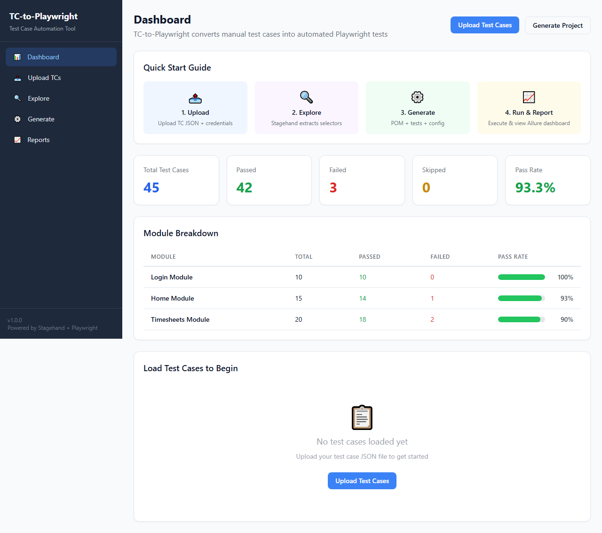
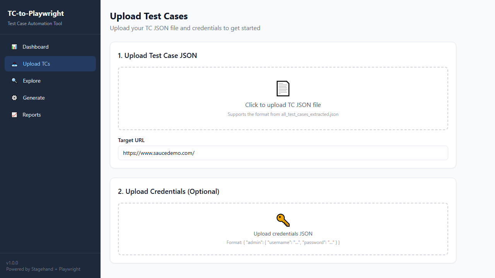
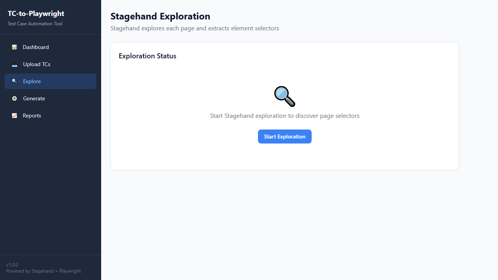
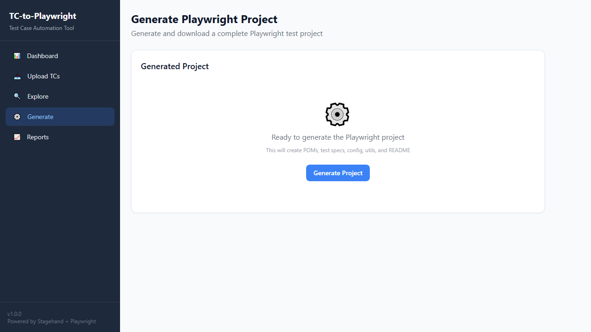

# TC-to-Playwright 🚀

<div align="center">


**AI-powered tool that automatically converts manual test cases into end-to-end Playwright tests.**

</div>

## 📖 About The Project

Writing end-to-end (E2E) automated tests can be extremely time-consuming and tedious, especially when migrating from a large repository of manual Test Cases (TCs). **TC-to-Playwright** bridges this gap using artificial intelligence. It takes in JSON files containing manual test instructions and uses AI (via Vercel AI SDK and Browserbase Stagehand) to analyze the DOM, extract necessary locators, and automatically generate robust, Page Object Model (POM) structured Playwright tests.

### How It Works

1. **Upload**: Submit your manual Test Cases in JSON format along with credentials for the target application.
2. **Explore (AI Extraction)**: Stagehand AI intelligently navigates the target application, extracting dynamic and stable CSS/XPath locators for elements described in the test steps.
3. **Generate**: The system generates a complete, ready-to-run Playwright automation framework based on the extracted data, incorporating industry best practices like the Page Object Model (POM).
4. **Run & Report**: You receive a fully configured automation suite that can be run instantly, complete with reporting dashboard integrations for easy result tracking.

## ✨ Key Features

- 🤖 **AI-Powered Locators**: Uses AI to automatically find the most reliable locators without manual inspection.
- 🏗️ **Page Object Model (POM)**: Generates maintainable test code structured around standard POM principles.
- ⚡ **Instant Execution**: Outputs a fully functional repository containing the tests and configuration ready to be executed out-of-the-box.
- 📊 **Beautiful Dashboards**: Built-in visual dashboard for monitoring test results, tracking module-level pass rates, and exploring test coverage.
- 📦 **Downloadable Project**: Download the generated Playwright project as a `.zip` archive.

## 🚀 Getting Started

Follow these steps to set up the project locally.

### Prerequisites

- [Node.js](https://nodejs.org/en/) (v18+)
- npm or yarn

### Installation

1. Clone the repository
   ```bash
   git clone https://github.com/allantaveras/tc-2-playwright
   cd homework
   ```

2. Install dependencies
   ```bash
   npm install
   ```

3. Setup environment variables. Rename `.env.example` to `.env.local` or create it:
   ```env
   # Target application URL (example)
   NEXT_PUBLIC_DEFAULT_URL=http://saucedemo.com/
   
   # Stagehand AI Configuration
   BROWSERBASE_API_KEY=your_api_key
   BROWSERBASE_PROJECT_ID=your_project_id
   
   # Server Port
   PORT=3000
   ```

4. Start the development server
   ```bash
   npm run dev
   ```

## 💻 Usage

### 1. Dashboard
Monitor your overall testing health, see the total number of test cases, and analyze the breakdown by module.

### 2. Upload Test Cases
Navigate to the **Upload** section to provide your manual test cases in JSON format and set the testing target credentials.

### 3. Generate Playwright Project
Head to **Generate Project** to have the AI process your manual instructions. Once finished, you can download a complete `.zip` archive containing the Next.js app and the newly generated Playwright scripts.

## 💡 Example Output

Here is a quick look at how **TC-to-Playwright** transforms your manual test cases into automated scripts.

### Before: Manual Test Case (JSON)

```json
[
  {
    "id": "L-001",
    "scenario": "Positive login - Admin",
    "test_case": "Verify that an admin user can successfully log into the system.",
    "preconditions": "Admin",
    "steps": "1. Go to Login\n2. Enter \"NT-5175\" in Username\n3. Enter \"1\" in Password\n4. Click on Sign In",
    "expected": "User is redirected to the Dashboard and Login page is no longer visible.",
    "sheet": "Login Module"
  }
]
```

### After: Generated Playwright Script (TypeScript)

```typescript
import { test, expect } from '@playwright/test';
import { ensureAuthenticated, AUTH_ROLES } from '../utils/authHelper';
import { LoginPage } from '../pages/LoginPage';

test.describe('Login Module', () => {
  test.beforeEach(async ({ page }) => {
    const loginPage = new LoginPage(page);
    await loginPage.goto();
  });

  test('L-001: Positive login - Admin', async ({ page }) => {
    const loginPage = new LoginPage(page);
    await loginPage.login('NT-5175', '1');
    await expect(page).not.toHaveURL(/.*login/);
  });
});
```

## 📸 Screenshots

### Dashboard


### Upload


### Explore


### Generate


## 📂 Folder Structure
- `/app` - Next.js App Router (Pages for Dashboard, Upload, Generate, Explore)
- `/components` - Reusable React components (UI elements, Layouts)
- `/public` - Static assets and documentation images
- `/api` - API Routes for the backend processes

## 📝 License

Distributed under the MIT License. See `LICENSE` for more information.
